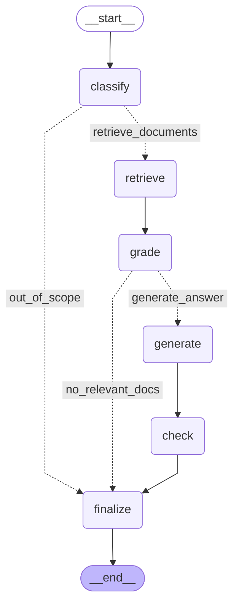

# LangChain プロジェクト

LangChainを使用したAIアプリケーション開発プロジェクト

## uvを使った環境構築

### 1. 初期セットアップ
```bash
# uvのインストール（まだの場合）
curl -LsSf https://astral.sh/uv/install.sh | sh

# 依存関係のインストール
uv sync
```

### 2. 基本的なコマンド

```bash
# 仮想環境でコマンド実行
uv run python main.py

# 新しいパッケージの追加
uv add package-name

# 開発用パッケージの追加
uv add --dev package-name

# パッケージの削除
uv remove package-name

# 依存関係の更新
uv lock --upgrade

# シェルの起動（仮想環境有効化）
uv shell
```

### 3. 環境変数設定

`.env`ファイルを作成してAPIキーを設定：
```
OPENAI_API_KEY=your_openai_api_key
```

#### LangGraphベースのRAGワークフロー

**重要**: LangGraphのRAGワークフローは相対インポートを使用しているため、**モジュールとして実行**する必要があります。

```bash
# srcディレクトリに移動してからモジュールとして実行
cd src
uv run python -m langgraph_rag.langgraph_rag
```

## プロジェクト構成

- `src/langgraph_rag/` - LangGraphベースのRAGワークフロー
  - `langgraph_rag.py` - メインワークフロー
  - `nodes/` - ワークフローノード
  - `routers/` - 条件分岐ロジック
  - `models/` - データモデル
- `pyproject.toml` - プロジェクト設定とパッケージ管理
- `uv.lock` - 依存関係のロックファイル

## LangGraphワークフロー可視化

### グラフ構造



### ノード説明

- **質問分類 (classify)**: 入力された質問がRAGで処理可能かを判定
- **ドキュメント検索 (retrieve)**: ChromaDBから関連文書を検索
- **関連性評価 (grade)**: 検索された文書の関連性を評価
- **回答生成 (generate)**: 関連文書を基に回答を生成
- **ハルシネーション検証 (check)**: 生成された回答の妥当性を検証
- **最終処理 (finalize)**: 最終的な回答を決定

### 条件分岐

1. **質問分類後**:
   - `out_of_scope`: スコープ外の質問 → そのまま終了 (答えられない旨を返す)
   - `retrieve_documents`: スコープ内の質問 → ドキュメント検索へ

2. **関連性評価後**:
   - `no_relevant_docs`: 関連文書なし → そのまま終了 (答えられない旨を返す)
   - `generate_answer`: 関連文書あり → 回答生成へ
