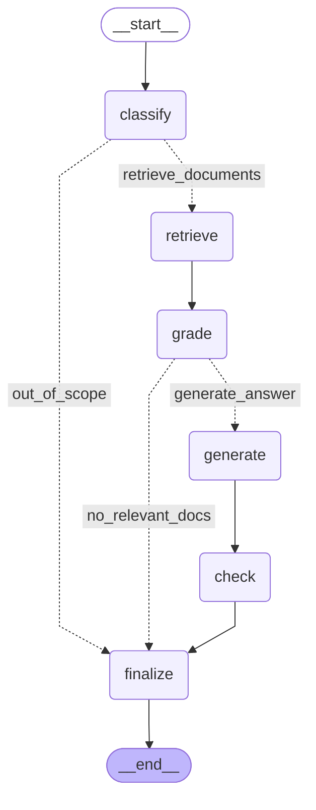

# RAGワークフロー可視化

## グラフ構造

## ノード説明

- **質問分類 (classify)**: 入力された質問がRAGで処理可能かを判定
- **ドキュメント検索 (retrieve)**: ChromaDBから関連文書を検索
- **関連性評価 (grade)**: 検索された文書の関連性を評価
- **回答生成 (generate)**: 関連文書を基に回答を生成
- **ハルシネーション検証 (check)**: 生成された回答の妥当性を検証
- **最終処理 (finalize)**: 最終的な回答を決定

## 条件分岐

1. **質問分類後**:
   - `out_of_scope`: 対象外の質問 → 直接終了
   - `retrieve_documents`: 処理対象の質問 → ドキュメント検索へ

2. **関連性評価後**:
   - `no_relevant_docs`: 関連文書なし → 直接終了
   - `generate_answer`: 関連文書あり → 回答生成へ
